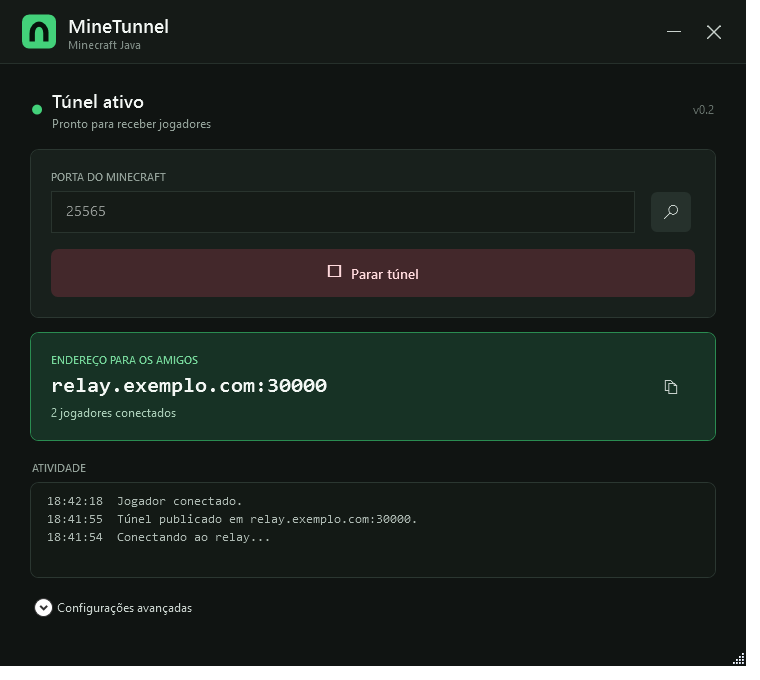
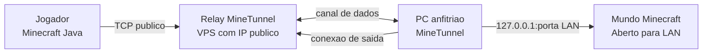

# MineTunnel

Aplicativo Windows e relay Linux para publicar mundos Minecraft Java abertos
para LAN sem configurar encaminhamento de portas no roteador.



## Visao geral

O MineTunnel cria um tunel TCP reverso entre o computador que hospeda o mundo
e uma VPS com IP publico. Somente o anfitriao executa o aplicativo. Os demais
jogadores entram pelo Minecraft normal usando o endereco `IP:PORTA` exibido.

O projeto nasceu para resolver um caso simples: jogar em um mundo LAN com
amigos quando o anfitriao nao pode ou nao quer alterar o roteador.

### O que ja funciona

- interface grafica nativa para Windows;
- deteccao automatica da porta usada pelo processo Java;
- validacao do Minecraft local antes de abrir o tunel;
- alocacao dinamica de uma porta publica por sessao;
- varios jogadores simultaneos no mesmo mundo;
- contador de conexoes e log de atividade;
- relay Linux leve, escrito em Go;
- execucao persistente do relay com systemd;
- nenhum aplicativo necessario no computador dos convidados.

> [!IMPORTANT]
> Este e um MVP para Minecraft Java e trafego TCP. O protocolo ainda nao usa
> TLS e o relay usa um segredo compartilhado. Consulte [Seguranca](SECURITY.md)
> antes de oferecer o servico publicamente.

## Como funciona



1. O aplicativo confirma que ha um servico ouvindo na porta local informada.
2. Ele abre um canal de controle para o relay e envia `register`.
3. O relay autentica o segredo, reserva uma porta e devolve o endereco publico.
4. Quando um jogador chega nessa porta, o relay envia `open` ao aplicativo.
5. O aplicativo abre um canal de dados para o relay e uma conexao local para o
   Minecraft.
6. Relay e aplicativo copiam os bytes nos dois sentidos ate a conexao terminar.

Esse desenho evita conexoes de entrada no PC anfitriao. Para detalhes de
concorrencia, ciclo de vida e falhas, leia [Arquitetura](docs/ARCHITECTURE.md).
O formato das mensagens esta em [Protocolo](docs/PROTOCOL.md).

## Inicio rapido

### Para quem hospeda o mundo

1. Obtenha `MineTunnel.exe` e um `minetunnel.json` configurado pelo operador do
   relay.
2. Mantenha os dois arquivos na mesma pasta.
3. Abra o mundo no Minecraft Java e escolha **Abrir para LAN**.
4. Abra o MineTunnel e clique no botao de detectar porta, ou informe a porta
   mostrada pelo Minecraft.
5. Clique em **Iniciar tunel**.
6. Envie aos amigos somente o endereco publico exibido.

### Para quem entra no mundo

1. Abra o Minecraft Java na mesma versao do anfitriao.
2. Acesse **Multijogador > Conexao direta**.
3. Informe o endereco `IP:PORTA` recebido.

O mundo, o aplicativo e o PC anfitriao precisam permanecer ligados. A VPS atua
somente como ponte e nao mantem o mundo online sozinha.

## Configuracao do aplicativo

Copie `app/minetunnel.json.example` para `minetunnel.json` ao lado do
executavel:

```json
{
  "relay": "SEU_IP_DO_VPS:7000",
  "local": "127.0.0.1:25565",
  "secret": "TROQUE_PELA_MESMA_SENHA_DO_RELAY",
  "name": "Meu-PC"
}
```

| Campo | Funcao |
| --- | --- |
| `relay` | IP ou dominio do relay e sua porta de controle. |
| `local` | Endpoint local do Minecraft. A interface altera apenas a porta. |
| `secret` | Segredo compartilhado usado para registrar o tunel. |
| `name` | Identificador amigavel gravado nos logs do relay. |

O arquivo contem uma credencial e nao deve ser enviado ao GitHub ou distribuido
publicamente.

## Compilando o aplicativo Windows

Requisitos:

- Windows 10 ou 11 de 64 bits;
- .NET Framework 4.8;
- Windows PowerShell.

Execute na raiz do projeto:

```powershell
powershell -ExecutionPolicy Bypass -File .\app\build.ps1
```

O build usa o compilador C# incluido no .NET Framework e gera
`app/dist/MineTunnel.exe`. Se ainda nao existir configuracao no diretorio de
saida, o script copia o exemplo sem credenciais reais.

## Compilando o relay

Requisitos:

- Go 1.22 ou mais recente;
- Linux AMD64 ou ARM64 para producao.

```bash
cd relay
go test ./...
go build -trimpath -o minetunnel-relay .
```

Execucao direta:

```bash
export MINETUNNEL_SECRET="use-um-segredo-longo-e-aleatorio"
./minetunnel-relay \
  --listen=:7000 \
  --public-host=SEU_IP_OU_DOMINIO \
  --port-start=30000 \
  --port-end=30100
```

| Porta | Protocolo | Finalidade |
| --- | --- | --- |
| `7000` | TCP | Registro, controle e canais de dados. |
| `30000-30100` | TCP | Uma porta publica por tunel ativo. |

Veja [Implantacao](docs/DEPLOYMENT.md) para configurar firewall, systemd,
atualizacao e verificacao do servico.

## Estrutura do repositorio

```text
MineTunnel/
|-- app/                  Aplicativo WPF e script de build
|-- client-v0.1/          Exemplo de configuracao do cliente legado
|-- deploy/               Unidade systemd e instalador do relay
|-- docs/                 Arquitetura, protocolo, deploy e diagnostico
|-- relay/                Servidor TCP em Go
|-- .github/workflows/    Verificacao automatica do projeto
|-- CHANGELOG.md          Historico de versoes
|-- CONTRIBUTING.md       Guia para contribuicoes
`-- SECURITY.md           Modelo de seguranca e reporte
```

## Decisoes de implementacao

- **WPF sobre .NET Framework 4.8:** produz um executavel pequeno e nativo sem
  empacotar um runtime adicional.
- **Go no relay:** facilita gerar binarios Linux autocontidos e lidar com muitas
  conexoes TCP concorrentes.
- **JSON delimitado por linha no handshake:** torna o protocolo simples de
  inspecionar; apos o handshake, o canal transporta TCP bruto.
- **Token aleatorio por sessao:** separa os canais de dados do segredo de
  registro e evita enviar o segredo em cada conexao de jogador.
- **Uma porta por sessao:** permite que jogadores vanilla usem apenas `IP:PORTA`,
  sem proxy ou mod no Minecraft.

## Limitacoes atuais

- somente Minecraft Java/TCP; Bedrock/UDP ainda nao e suportado;
- sem TLS entre o aplicativo e o relay;
- um segredo compartilhado por instalacao do relay;
- configuracao local armazena o segredo em texto simples;
- sem reconexao automatica, instalador Windows ou atualizador;
- sem painel administrativo, limites por usuario ou metricas persistentes;
- a capacidade depende da CPU e da rede da VPS e do upload do anfitriao.

## Roadmap

- [ ] credenciais individuais e revogaveis;
- [ ] TLS com validacao de certificado;
- [ ] reconexao automatica com backoff;
- [ ] instalador e atualizacao do aplicativo;
- [ ] telemetria local opcional e diagnostico exportavel;
- [ ] limites de conexao e protecao contra abuso;
- [ ] suporte experimental a UDP/Bedrock.

## Documentacao

- [Arquitetura](docs/ARCHITECTURE.md)
- [Protocolo](docs/PROTOCOL.md)
- [Implantacao](docs/DEPLOYMENT.md)
- [Solucao de problemas](docs/TROUBLESHOOTING.md)
- [Seguranca](SECURITY.md)
- [Como contribuir](CONTRIBUTING.md)

## Licenca

Distribuido sob a [licenca MIT](LICENSE).
