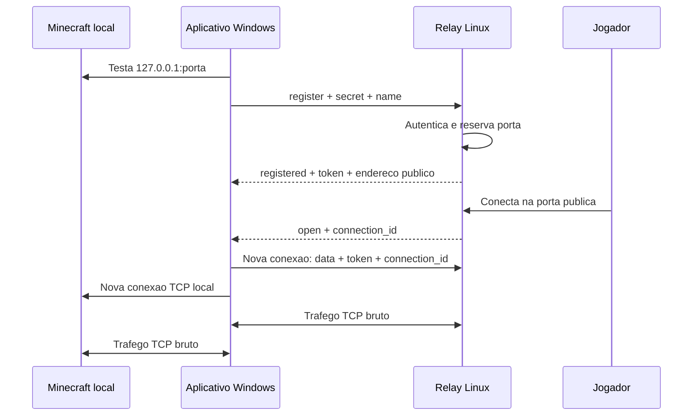

# Arquitetura

Este documento descreve os componentes, o ciclo de vida de uma sessao e as
decisoes tecnicas do MineTunnel.

## Componentes

### Aplicativo Windows

O arquivo `app/MineTunnel.cs` contem a interface WPF e o cliente de tunel. A
aplicacao e dividida logicamente em quatro responsabilidades:

1. **Interface e estado:** controla `Idle`, `Connecting`, `Active` e `Error`,
   atualizando botao, textos, contador e log.
2. **Configuracao:** le e grava `minetunnel.json` ao lado do executavel.
3. **Descoberta local:** identifica processos `java` e `javaw`, executa
   `netstat -ano -p tcp` e cruza portas em escuta com os PIDs encontrados.
4. **Transporte:** mantem o canal de controle e cria um par de sockets para cada
   jogador recebido.

Antes do registro, o cliente testa `127.0.0.1:PORTA` com timeout de 1,8 segundo.
Isso evita publicar uma porta quando o mundo ainda nao foi aberto para LAN.

### Relay Linux

O arquivo `relay/main.go` implementa um servidor TCP concorrente. Um listener
principal recebe tanto registros quanto canais de dados. A primeira mensagem
JSON informa qual funcao a conexao exercera.

O relay mantem em memoria:

- sessoes indexadas por token aleatorio;
- portas publicas atualmente reservadas;
- conexoes de jogadores aguardando pareamento;
- um listener publico por sessao ativa.

Mutexes protegem os mapas globais, os pareamentos pendentes e a escrita no canal
de controle. Cada aceite ou jogador e tratado em sua propria goroutine.

### Minecraft local

O MineTunnel nao interpreta o protocolo Minecraft. Para cada jogador ele abre
uma conexao TCP para `127.0.0.1:PORTA` e encaminha bytes de forma transparente.
Isso reduz acoplamento com versoes do jogo, mods e loaders.

## Ciclo de vida de uma sessao

### Registro

O segredo e comparado em tempo constante. Em caso de sucesso, o relay percorre
o intervalo configurado e reserva a primeira porta que puder abrir. Em seguida,
gera 24 bytes aleatorios para o token da sessao.

O canal de controle permanece aberto. Seu encerramento fecha o listener publico,
todos os jogadores pendentes e libera a porta para outra sessao.

### Chegada de um jogador

O listener da sessao aceita a conexao publica e gera 16 bytes aleatorios para o
`connection_id`. A conexao fica pendente enquanto uma mensagem `open` e enviada
ao aplicativo.

O aplicativo responde criando uma nova conexao para a porta de controle. Ela se
identifica como `data` usando token e `connection_id`. O relay remove o item da
lista de pendencias e une os dois sockets.

Se o canal de dados nao chegar em 20 segundos, a conexao do jogador e fechada.

### Transporte

Depois do pareamento nao ha mais JSON no canal de dados. Cada lado inicia duas
copias assincronas, uma por direcao. Quando uma direcao termina, os sockets sao
fechados e a outra copia tambem e encerrada.

## Concorrencia e isolamento

- cada sessao recebe sua propria porta e token;
- cada jogador recebe seu proprio `connection_id` e canal de dados;
- escritas no controle sao serializadas para nao misturar mensagens JSON;
- a remocao de sessoes e portas e protegida por mutex;
- `sync.Once` torna o fechamento da sessao idempotente;
- o aplicativo acompanha sockets ativos para fecha-los ao parar o tunel.

## Falhas esperadas

| Falha | Comportamento |
| --- | --- |
| Segredo incorreto | Relay devolve `authentication failed`. |
| Nenhuma porta livre | Registro recebe `no public ports available`. |
| Minecraft fechado | Aplicativo falha antes do registro ou encerra o jogador. |
| Canal de controle cai | Relay fecha a sessao e libera a porta. |
| Canal de dados atrasa | Jogador e desconectado apos 20 segundos. |
| Aplicativo e fechado | Sockets sao fechados; relay limpa a sessao. |
| VPS reinicia | Sessoes ativas caem e precisam ser iniciadas novamente. |

## Escalabilidade

O numero maximo teorico de tuneis simultaneos e o tamanho do intervalo de portas.
No padrao `30000-30100`, sao 101 sessoes. O limite pratico pode ser menor e
depende de CPU, memoria, descritores de arquivo e banda da VPS.

Cada jogador consome:

- uma conexao publica na porta da sessao;
- um canal de dados na porta de controle;
- uma conexao local no computador anfitriao;
- duas rotinas de copia em cada extremidade do tunel.

Antes de aumentar o intervalo, implemente autenticacao individual, limites por
usuario, observabilidade e protecao contra abuso.
